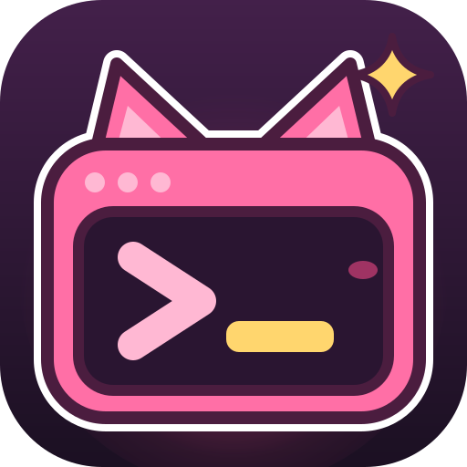

<p align="center">
  
</p>

<h1 align="center">UwUSSH</h1>

<p align="center">
  The SSH client I build for myself, because every other one annoyed me. (◕‿◕✿)<br/>
  SSH · SFTP · Port forwarding · Self-hosted sync · Windows · macOS · Linux
</p>

---

## Why this exists

Every SSH client I tried annoyed me in one way or another. The old ones are
powerful but look like 2004 and forget everything the moment you switch
machines. The pretty ones sync your whole host list, keys included, through
somebody else's cloud, usually behind a subscription. So I started building my
own, the way I want it, with a sync server that runs on my own box.

- **Just for fun.** No company, no team, no schedule, no promises. I work on it
  when I have time and feel like it, so don't expect steady development, and
  don't be surprised by long breaks.
- **Written with AI.** Almost all of the code is written with Claude, because
  I'm honestly not a great programmer. Not your thing? No hard feelings, just
  pick something else.
- **Use it, fork it, do what you want with it.** The license only asks one
  thing: if you pass on a changed version, its source stays open too.
- **No support.** Issues and pull requests are okay, but I might answer late or
  not at all, and I mostly build what I need myself.

This is the sibling of [UwUMail](https://github.com/MinifyX/UwUMail-Client), and
it shares its design system, its tooling and its cat.

## What it is

UwUSSH is an open-source SSH client for people who have more hosts than they
can remember and more than one machine to reach them from.

- **Your hosts, your keys, your server.** The sync server is
  [self-hosted](#the-sync-server) and gets only ciphertext. Host names, keys and
  passwords are encrypted on your machine before they ever leave it, so the
  server can relay them without being able to read them.
- **Keys and logins live in the vault.** Generate or import a key, add the
  passphrase once, assign it to as many hosts as you like. Unlock the vault and
  everything is there, on every device, without copying key files around.
- **It imports your old setup.** PuTTY and KiTTY sessions straight from the
  registry, `~/.ssh/config`, Termius, WinSCP, mRemoteNG and MobaXterm exports.
  Nobody retypes 80 hosts.
- **Calm, dense UI.** A quiet host tree, tabs and splits, a command palette on
  `Ctrl+K`, and an inspector you can fold away when you just want a terminal.
- **Everything a session needs.** Agent auth, ProxyJump chains, local, remote
  and dynamic port forwarding, an SFTP browser, snippets and broadcast input.
- **Private by default.** No telemetry, no account with me, no subscription.
  The vault auto-locks, and key material never leaves the Rust core.
- **Playful.** Nyu, the terminal cat, keeps you company. Prefer it plain?
  Settings → Tone → Neutral. Security warnings are never playful, in either
  tone.

> **Status:** milestone 0 is done, and the Termius import works. UwUSSH connects
> to SSH hosts — password or key file, PuTTY `.ppk` included — keeps a host
> list, and checks host keys on first contact and every time after. The terminal
> path is measured: 41–46 MiB/s without a stuttering frame, as long as the
> renderer acknowledges what it parsed, because without that xterm.js silently
> drops output ([the spike](docs/m0-spike.md)).
>
> Termius has no export, so UwUSSH reads its local database directly — hosts,
> logins, keys with their passphrases, trusted host keys and snippets — and puts
> the secrets in an encrypted vault ([how](docs/architecture.md#termius-which-has-no-export)).
> PuTTY/KiTTY and `ssh_config` import, tabs and agent login come next; the
> [roadmap](docs/roadmap.md) has the order.

## The sync server

The server is a separate repo, `UwUSSH-Server`, and will land with milestone M2.
One Rust binary, one Docker image, one SQLite file:

```yaml
services:
  uwussh:
    image: ghcr.io/minifyx/uwussh-server:latest
    ports: ['8080:8080']
    volumes: ['./data:/data']
    environment:
      UWUSSH_DB: /data/uwussh.db
      UWUSSH_REGISTRATION: invite # open | invite | closed
```

TLS is your reverse proxy's job. Backup is copying one file. And if you'd
rather not run a server at all, "local only" is a first-class choice, not a
downgrade.

## Project layout

| Path                   | What lives there                                |
| ---------------------- | ----------------------------------------------- |
| `apps/desktop`         | The Tauri 2 app (React UI + Rust shell)         |
| `apps/desktop/e2e`     | End-to-end run against a real SSH server        |
| `crates/uwussh-core`   | Session engine: SSH, local shells, flow control |
| `crates/uwussh-store`  | SQLite: hosts, identities, trusted host keys    |
| `crates/uwussh-vault`  | Key derivation, record encryption               |
| `crates/uwussh-sync`   | Sync client: clocks, outbox, merging            |
| `crates/uwussh-import` | PuTTY, KiTTY, `ssh_config`, Termius             |
| `crates/uwussh-proto`  | Shared types between client and server          |
| `brand/`               | Nyu: app icon, symbol, mono symbol              |
| `docs/`                | Vision, architecture, design, roadmap           |

## Development

Requirements:

- Node.js 24 and pnpm 11 (`corepack enable`)
- Rust stable (via [rustup](https://rustup.rs))
- Platform prerequisites for Tauri: see
  [tauri.app/start/prerequisites](https://tauri.app/start/prerequisites/)
  (Windows: Visual Studio C++ Build Tools and WebView2)

```bash
pnpm install
pnpm tauri dev
```

No server at hand? A toy SSH server for trying things out — `127.0.0.1:2222`,
user `uwu`, password `nyu`:

```bash
cargo run -p uwussh-core --example dev_sshd
```

Checks:

```bash
pnpm typecheck && pnpm lint
cargo fmt --check && cargo clippy --all-targets -- -D warnings && cargo test
node apps/desktop/e2e/run.mjs     # end to end, Windows
```

## Documentation

- [Konzept](KONZEPT.md) — the full concept, in German
- [Vision](docs/vision.md) — what I want UwUSSH to be and what it will never do
- [Architecture](docs/architecture.md) — how the pieces fit together
- [M0 spike](docs/m0-spike.md) — the throughput measurement everything else waits on
- [Design](docs/design.md) — colors, type, Nyu, tone of voice
- [Roadmap](docs/roadmap.md) — my wish list, without dates

## License

UwUSSH is free software under the [GNU GPL v3.0](LICENSE): use it, change it,
fork it, share it. If you pass on a changed version, its source has to stay
open too.
